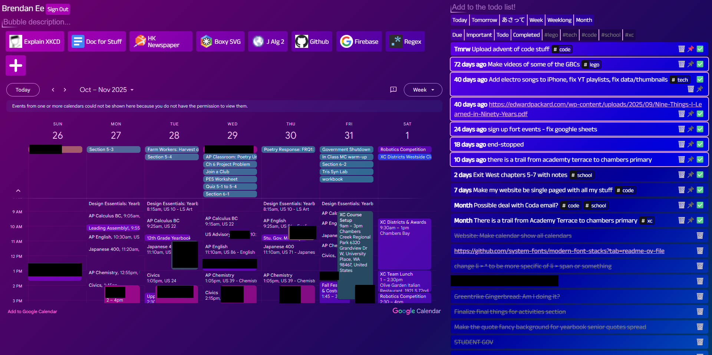

# About
My personal "homepage," although the name's a bit of a misnomer- it's currently set as my new tab page. Bit of a pet project!
## Features
- Dark mode!!
- Basic Firebase auth
- Todo list with filters and importance marking (the pin icon)
- Good-looking Google calender embed (`mix-blend-mode` for the win)
- Quicklinks to common websites
- ✨Cloud✨ synchronization, by way of a scuffed Firestore thing
# Quickstart
Just for me honestly. _You don't want to use this_, it works not well.
That being said, the Firestore has collections named `bubbles` and `list`, and uses a timestamp for each document's name.